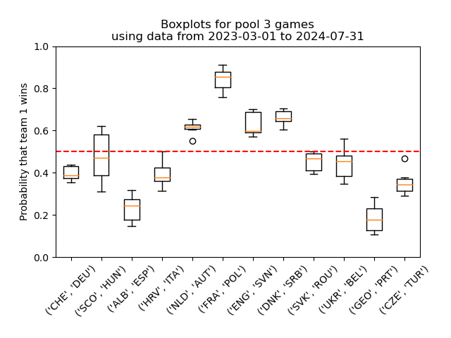
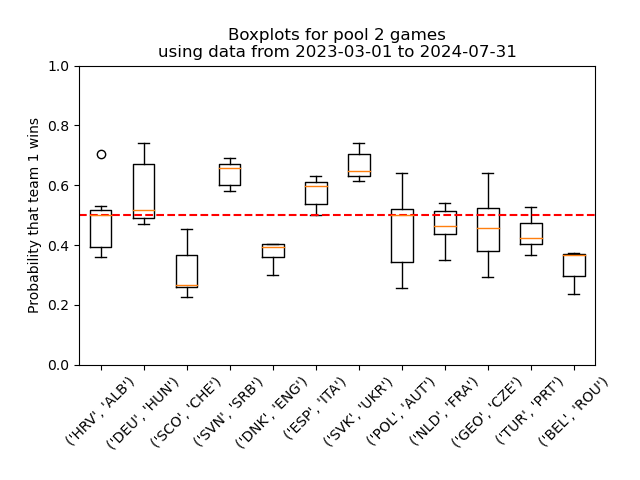
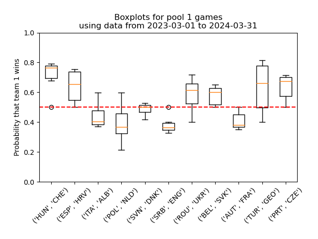

# UEFA Euro 2024

Simple pronostics for Euro 2024 football cup based on Bradley-Terry and some past data.

## HOWTO
- Fill out `input_data/uefa-data-euro24.csv` with most up to date results;
- In `conf.py`, fill out `ALL_GAMES`  with the games you want a pronostic for, and `TITLE` with the title you want for the graph that will be generated;
- Run `01_make_games_list.py` then `02_bradley_terry.py` then `03_pronostics_from_bt.py`
- See in the terminal for easy to read pronostics, and see in `boxplots/` for a nice graph.

## Round 3

## Round 2

## Round 1

