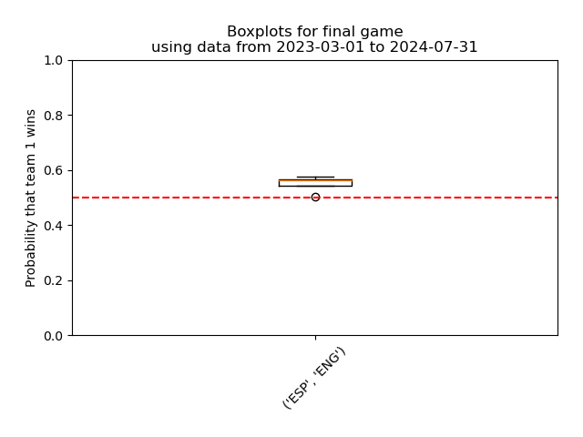
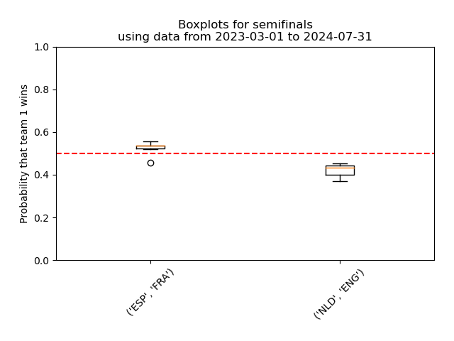
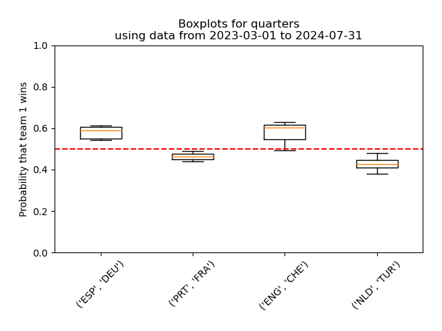
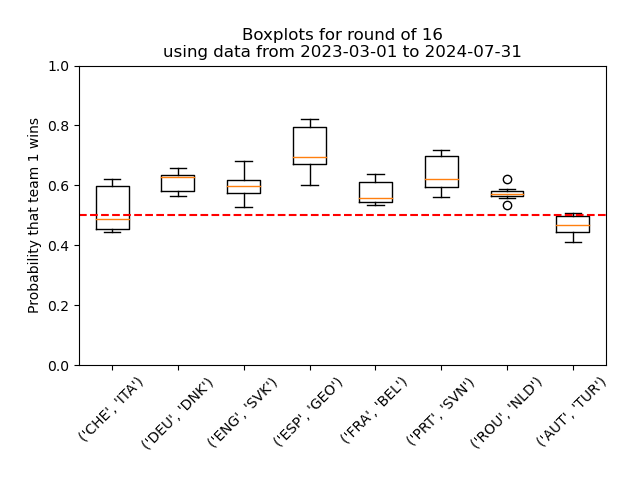

# UEFA Euro 2024

Simple pronostics for Euro 2024 football cup based on Bradley-Terry and some past data. See also https://github.com/jbudynek/rugby2023

## HOWTO
- Fill out `input_data/uefa-data-euro24.csv` with most up to date results;
- In `conf.py`, fill out `ALL_GAMES`  with the games you want a pronostic for, and `TITLE` with the title you want for the graph that will be generated;
- Run `01_make_games_list.py` then `02_bradley_terry.py` then `03_pronostics_from_bt.py`
- See in the terminal for easy to read pronostics, and see in `boxplots/` for a nice graph.

## Final game

## Semifinals and results

Results: **I got 2 out of 2 predictions right!** All in all so far, 27 out of 50 so a success rate of 54%.

 
Results of semifinals

|  **Team 1** | **Team 2** | **Winner** | **Bet** | **1 if bet is right** |
|---|---|---|---|---|
| Spain | France | Spain | Spain | 1 |
| Netherlands | England | England | England | 1 | 

## Quarters and results

Results: **I got 3 out of 4 predictions right! That's 75%.** All in all so far, 25 out of 48 so a success rate of 52%.

 
Results of quarters

|  **Team 1** | **Team 2** | **Winner** | **Bet** | **1 if bet is right** |
|---|---|---|---|---|
| Spain | Germany | Spain | Spain | 1 |
| Portugal | France | France | France | 1 |
| England | Switzerland | England | England | 1 |
| Netherlands | Turkey | Netherlands | Turkey | 0 | 

## Round of 16 and results

Results: **I got 7 out of 8 predictions right! That's 87.5%.** All in all so far, 22 out of 44 so an even 50% success rate.

 
Results of round of 16

|  **Team 1** | **Team 2** | **Winner** | **Bet** | **1 if bet is right** |
|---|---|---|---|---|
| Switzerland | Italy | Switzerland | Switzerland | 1 |
| Germany | Denmark | Germany | Germany | 1 |
| England | Slovakia | England | England | 1 |
| Spain | Georgia | Spain | Spain | 1 |
| France | Belgium | France | France | 1 |
| Portugal | Slovenia | Portugal | Portugal | 1 |
| Romania | Netherlands | Netherlands | Romania | 0 |
| Austria | Turkey | Turkey | Turkey | 1 |

## Pool games analysis

Well it was not a huge success. Round 1: 8 out of 12 (67%). Round 2: 4 out of 12 (33%). Round 3: 3 out of 12 (25%)!!!
All in all, **15 out of 36 so only 42% good pronostics**. I guess there were many draws, which we don't use well in modeling, and also don't predict well.
Let's hope we do better in the next stages!

 
Results of all pool games

| **Round** | **Team 1** | **Team 2** | **Winner** | **Bet** | **1 if bet is right** |
|---|---|---|---|---|---|
| Round 1 | Germany | Scotland | Germany | Germany | 1 |
| Round 1 | Hungary | Switzerland | Switzerland | Hungary | 0 |
| Round 1 | Spain | Croatia | Spain | Spain | 1 |
| Round 1 | Italy | Albania | Italy | Albania | 0 |
| Round 1 | Poland | Netherlands | Netherlands | Netherlands | 1 |
| Round 1 | Slovenia | Denmark | N/A | Slovenia | 0 |
| Round 1 | Serbia | England | England | England | 1 |
| Round 1 | Romania | Ukraine | Romania | Romania | 1 |
| Round 1 | Belgium | Slovakia | Slovakia | Belgium | 0 |
| Round 1 | Austria | France | France | France | 1 |
| Round 1 | Turkey | Georgia | Turkey | Turkey | 1 |
| Round 1 | Portugal | Czech Republic | Portugal | Portugal | 1 |
| Round 2 | Croatia | Albania | N/A | Albania | 0 |
| Round 2 | Germany | Hungary | Germany | Germany | 1 |
| Round 2 | Scotland | Switzerland | N/A | Switzerland | 0 |
| Round 2 | Slovenia | Serbia | N/A | Slovenia | 0 |
| Round 2 | Denmark | England | N/A | England | 0 |
| Round 2 | Spain | Italy | Spain | Spain | 1 |
| Round 2 | Slovakia | Ukraine | Ukraine | Slovakia | 0 |
| Round 2 | Poland | Austria | Austria | Austria | 1 |
| Round 2 | Netherlands | France | N/A | France | 0 |
| Round 2 | Georgia | Czech Republic | N/A | Czech Republic | 0 |
| Round 2 | Turkey | Portugal | Portugal | Portugal | 1 |
| Round 2 | Belgium | Romania | Belgium | Romania | 0 |
| Round 3 | Switzerland | Germany | N/A | Germany | 0 |
| Round 3 | Scotland | Hungary | Hungary | Scotland | 0 |
| Round 3 | Croatia | Italy | N/A | Italy | 0 |
| Round 3 | Albania | Spain | Spain | Spain | 1 |
| Round 3 | Netherlands | Austria | Austria | Austria | 1 |
| Round 3 | France | Poland | N/A | France | 0 |
| Round 3 | England | Slovenia | N/A | England | 0 |
| Round 3 | Denmark | Serbia | N/A | Denmark | 0 |
| Round 3 | Slovakia | Romania | N/A | Romania | 0 |
| Round 3 | Ukraine | Belgium | N/A | Belgium | 0 |
| Round 3 | Czech Republic | Turkey | Turkey | Turkey | 1 |
| Round 3 | Georgia | Portugal | Georgia | Portugal | 0 |

## Round 3

## Round 2

## Round 1

